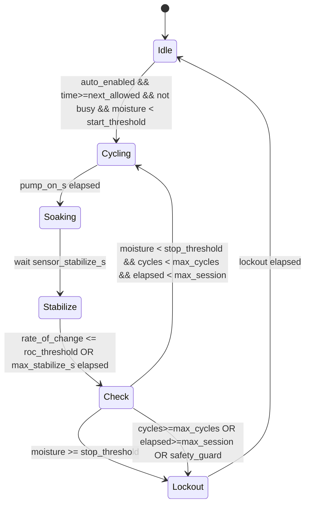

# Auto‑Irrigation Refactor Specification (4‑plants)

Version: 1.0  
Last updated: 2025‑08‑10

## Scope and goals

- **Per‑plant control**: `plant_i` controls `pump_i` and reads `sensor_i`.
- **Sensor‑driven automation**: Start irrigation when moisture is below a per‑plant start threshold; stop when at/above a per‑plant stop threshold (hysteresis).
- **Cycled watering**: Repeated ON/soak cycles until the stop condition or safety limits are met.
- **One pump at a time**: Enforce single‑pump concurrency for the whole device.
- **Adaptive sampling**: Increase moisture sampling frequency while irrigating; default to a slower sampling rate when idle (5 minutes, adjustable via Home Assistant).
- **Stabilized readings**: Before each moisture decision, wait for the sensor to stabilize; optionally require the rate of change to be below a threshold.
- **Post‑session sleep**: Enforce a per‑plant lockout after a session to avoid overwatering.
- **Home Assistant control**: All key thresholds/durations are adjustable from HA.

## Glossary

- **Session**: A contiguous irrigation operation for one plant, consisting of one or more ON/soak cycles.
- **Cycle**: Pump ON for `pump_on_s` then OFF waiting for `soak_s`, followed by a moisture read and decision.
- **Lockout**: A per‑plant post‑session sleep during which automation will not start another session.

## Functional requirements

1. **Triggering**
   - If `auto_enabled_plant_i` is true, `now >= next_allowed_time_plant_i` (no lockout), there is no other pump running, and `moisture_pct_i < start_threshold_pct_i`, start a new session for plant i.
2. **Cycle loop**
   - Turn `pump_i` ON for `pump_on_s_i` (default 10 s).
   - Turn `pump_i` OFF.
   - Wait `sensor_stabilize_s_i`.
   - If stabilization by rate‑of‑change is enabled, continue sampling at `irrigation_sampling_interval_s_i` until the absolute rate of change is ≤ `roc_threshold_pct_per_s_i` or until `max_stabilize_s_i` is reached.
   - Take a decision reading: if `moisture_pct_i ≥ stop_threshold_pct_i` then stop session; else repeat the cycle.
3. **Stop conditions (any)**
   - `moisture_pct_i ≥ stop_threshold_pct_i`.
   - `cycles_in_session_i ≥ max_cycles_i`.
   - `elapsed_session_s_i ≥ max_session_s_i`.
   - Safety guard trips (e.g., tank empty, sensor invalid).
4. **After‑session behavior**
   - Enter per‑plant lockout for `post_session_lockout_min_i` minutes.
   - Release the global concurrency lock.
5. **Sampling policy**
   - When not irrigating, update each `sensor_i` every `idle_sampling_interval_s` (default 300 s = 5 min, HA‑configurable).
   - While irrigating, override with faster sampling `irrigation_sampling_interval_s_i` (e.g., 1–2 s, HA‑configurable), driven by explicit `component.update` calls inside the session script.
6. **Concurrency**
   - Only one pump/session may be active at a time across all plants. If a session is running, others must wait.

## Non‑functional requirements

- **Reliability**: Sessions must terminate on safety caps even if sensor reads are noisy or missing.
- **Observability**: Expose HA entities for status, last session results, abort reasons.
- **Configurability**: All per‑plant thresholds/durations are adjustable from HA. Provide sensible defaults.

## Per‑plant configuration (adjustable from Home Assistant)

- **enable_auto**: boolean.
- **start_threshold_pct**: lower hysteresis bound to start a session.
- **stop_threshold_pct**: upper hysteresis bound to end a session.
- **pump_on_s**: ON duration per cycle (default 10 s).
- **soak_s**: OFF wait between cycles to let water absorb.
- **sensor_stabilize_s**: initial wait after pump changes before evaluating moisture.
- **irrigation_sampling_interval_s**: faster sampling interval while irrigating.
- **idle_sampling_interval_s**: sampling interval while idle (default 300 s, adjustable).
- **roc_threshold_pct_per_s**: maximum allowed absolute rate‑of‑change to consider sensor stable.
- **max_stabilize_s**: cap for stabilization waiting window.
- **max_cycles**: cap on number of cycles per session.
- **max_session_s**: cap on total session duration.
- **post_session_lockout_min**: per‑plant lockout after session completes.
- Optional extras per plant:
  - **daily_max_on_s**: cap total pump ON time per day.
  - **min_time_between_sessions_min**: additional spacing beyond lockout.
  - **calibration_wet/dry**: linear calibration to percent if sensors are raw.

## Defaults (initial)

- start_threshold_pct: 30%
- stop_threshold_pct: 40%
- pump_on_s: 10 s
- soak_s: 30 s
- sensor_stabilize_s: 3 s
- irrigation_sampling_interval_s: 1–2 s (2 s recommended)
- idle_sampling_interval_s: 300 s (5 min)
- roc_threshold_pct_per_s: 0.2
- max_stabilize_s: 30 s
- max_cycles: 8
- max_session_s: 600 s (10 min)
- post_session_lockout_min: 60 min

## State machine

## Sensor stabilization and rate‑of‑change logic

- Maintain the last `N` readings with timestamps while irrigating (e.g., N=3–5).
- Compute instantaneous rate of change: `roc = abs((m[n] - m[n-1]) / (t[n] - t[n-1]))` in %/s.
- Consider stable when both conditions are true:
  - At least one `sensor_stabilize_s` wait has passed after pump change, and
  - `roc <= roc_threshold_pct_per_s`.
- If `max_stabilize_s` is reached without stability, proceed with the latest reading to avoid stalling.

## Concurrency model (single‑pump policy)

- Global mutex: `irrigation_active` boolean and `active_plant_id` global.
- Acquisition: A session only starts if the mutex is free. On start, set `irrigation_active=true` and `active_plant_id=i`.
- Release: On session completion or abort, clear both.
- Queueing policy: Simple re‑evaluation. If a plant triggers while busy, it defers; the next idle sensor update will trigger it again if still below `start_threshold` and within allowed time. (Improvements section details a FIFO queue option.)

## Safety and guards

- **Water source**: Optional tank level/flow sensor; prevent start and abort session if unavailable.
- **Sensor validity**: If sensor state is `unavailable`, `nan`, or out‑of‑range, abort with reason.
- **Hardware protection**: Enforce `max_session_s`, `max_cycles`, and optional `max_pump_continuous_on_s`.
- **Scheduling windows (optional)**: Only allow irrigation in configured time windows.
- **Manual overrides**: HA buttons to start/stop a session per plant.

## Home Assistant integration (entities per plant)

- Switches/Buttons
  - `switch.enable_auto_plant_i`
  - `button.start_irrigation_plant_i`
  - `button.stop_irrigation_plant_i`
- Numbers (entity_category: config)
  - `number.start_threshold_pct_plant_i`
  - `number.stop_threshold_pct_plant_i`
  - `number.pump_on_s_plant_i`
  - `number.soak_s_plant_i`
  - `number.sensor_stabilize_s_plant_i`
  - `number.irrigation_sampling_interval_s_plant_i`
  - `number.idle_sampling_interval_s_plant_i`
  - `number.roc_threshold_pct_per_s_plant_i`
  - `number.max_stabilize_s_plant_i`
  - `number.max_cycles_plant_i`
  - `number.max_session_s_plant_i`
  - `number.post_session_lockout_min_plant_i`
- Status/Telemetry
  - `text_sensor.irrigation_state_plant_i` (Idle, Cycling, Soaking, Stabilize, Lockout, Error)
  - `sensor.last_session_cycles_plant_i`
  - `sensor.last_session_duration_s_plant_i`
  - `sensor.last_session_reason_plant_i` (Completed, MaxCycles, MaxSession, TankEmpty, SensorInvalid, ManualStop)
  - `sensor.lockout_remaining_min_plant_i`
  - `binary_sensor.irrigation_busy`

## Implementation plan (step‑by‑step)

1. **Define per‑plant HA numbers and switches**
   - Add `number` entities for thresholds, durations, and sampling intervals listed above with sensible defaults.
   - Add `switch.enable_auto_plant_i`, `button.start_irrigation_plant_i`, and `button.stop_irrigation_plant_i`.
2. **Create global state**
   - `globals`: `irrigation_active` (bool, restore_value), `active_plant_id` (int), per‑plant `lockout_until_epoch` (uint32), optional daily counters.
3. **Idle sampling loop**
   - Implement an `interval` that, every `idle_sampling_interval_s`, calls `component.update` on each plant’s moisture sensor when not irrigating.
4. **Per‑plant session script** (`script.irrigate_plant(i)`)
   - Acquire global mutex; set state sensors.
   - For `cycle=1..max_cycles` while elapsed < `max_session_s`:
     - Pump ON for `pump_on_s`.
     - Pump OFF; wait `sensor_stabilize_s`.
     - Stabilize: loop `component.update(sensor_i)` every `irrigation_sampling_interval_s` until `roc <= roc_threshold` or `max_stabilize_s` reached.
     - Read moisture; if `>= stop_threshold` break; else continue.
   - Set `lockout_until` = now + `post_session_lockout_min`.
   - Record `last_session_*` metrics and reason.
   - Release mutex; set state to Idle.
5. **Automation triggers**
   - On moisture sensor update: if `auto_enabled` and below `start_threshold` and past `lockout_until` and not busy, start the session script for that plant.
   - On `button.start_irrigation_plant_i`: start session immediately if not busy; else notify busy.
   - On `button.stop_irrigation_plant_i`: stop current session if `active_plant_id==i`.
6. **Safety checks**
   - Before start and before each cycle, verify water source, sensor validity, and session caps; abort with reason if violated.
7. **Observability**
   - Update `text_sensor.irrigation_state_plant_i` across states; publish metrics at end of session.
8. **Daily counters (optional)**
   - Track and reset at local midnight; block start when exceeding `daily_max_on_s`.
9. **Documentation**
   - Update `connections-diagram.md` if wiring changes (not expected for this refactor).

## Testing plan

- Unit‑like tests on device using dry soil:
  - Verify session starts when below `start_threshold` and stops at/above `stop_threshold`.
  - Verify `max_cycles` and `max_session_s` aborts.
  - Verify `post_session_lockout_min` prevents immediate re‑start.
  - Verify only one pump can run at a time; try to start another plant during active session.
- Sampling behavior:
  - Confirm idle sampling uses `idle_sampling_interval_s` and increases during irrigation.
  - Confirm stabilization waits and ROC threshold gating work (reduce `roc_threshold` for test visibility).
- HA controls:
  - Changing numbers in HA affects behavior live.
  - Buttons start/stop as expected; state sensors update.

## Acceptance criteria

- One‑pump‑at‑a‑time is enforced reliably.
- Sessions obey hysteresis thresholds and safety limits.
- Adaptive sampling and stabilization operate as configured.
- Lockout applied after sessions; automation respects it.
- All per‑plant knobs visible and editable in HA.

## Edge cases

- Sensor unavailable or NAN mid‑session → abort with `SensorInvalid` reason and lockout.
- Tank empty detected mid‑session → abort with `TankEmpty` reason and lockout.
- Manual stop → immediate stop, reason `ManualStop`, normal lockout applies.
- Rapid ambient changes causing oscillation → ROC gating plus hysteresis should prevent chatter; consider increasing `soak_s`.

## Possible improvements (future)

- FIFO pending queue for fairness when multiple plants are eligible during a busy session.
- Time‑window scheduling (e.g., only water 06:00–09:00).
- Weather‑aware adjustments using HA (forecast rain reduces thresholds).
- Soil model: adapt `pump_on_s` or `soak_s` based on observed absorption rate per plant.
- Per‑plant learned `stop_threshold` trim by analyzing historical sessions.
- Multi‑sample median filtering for moisture reads during stabilization to reduce spikes.

## Open confirmations

1. Operate thresholds in percent mapped in ESPHome (recommended). If raw ADC is preferred, define raw start/stop units.
2. Desired defaults OK? Any per‑plant overrides to initialize?
3. Presence of a tank/flow sensor to guard irrigation?
4. Allowed schedule windows needed now or later?

## Notes on ESPHome implementation details

- Use ESPHome `number`, `switch`, and `button` components (entity_category: config) for HA control.
- For moisture sensors, keep base `update_interval: never` or a long interval, and rely on `interval:` + `component.update:` to implement idle and irrigating sampling policies.
- Use `globals:` with `restore_value: true` for mutex and lockout persistence across reboots.
- Use `lambda:` and small ring buffers in `globals:` to compute ROC during stabilization.
- Ensure all actions include short `delay:` to keep the event loop responsive.
